# Grain growth for astrophysics with Discontinuous Galerkin schemes
by Maxime Lombart and Guillaume Laibe

Manuscript is submitted for publication in the Monthly Notices of the Royal Astronomical Society.

This repository contains the data and code used to reproduce all figures shown in the paper.

## Abstract
Depending on their sizes, dust grains store more or less charges, catalyse more or less chemi- cal reactions, intercept more or less photons and stick more or less efficiently to form embryos of planets. Hence the need for an accurate treatment of dust coagulation and fragmentation in numerical modelling. However, existing algorithms for solving the coagulation equation are over-diffusive in the conditions of 3D simulations. We address this challenge by developping a high-order solver based on the Discontinuous Galerkin method. This algorithm conserves mass to machine precision and allows to compute accurately the growth of dust grains over several orders of magnitude in size with a very limited number of dust bins.

## Results
Python 3 is used to produce figures for constant, additive and multiplicative coagulation kernels.

### Benchmarks
#### Constant kernel
Python scripts are located in ``` kconst/code```.

##### Positivity, mass conservation and accuracy
Data are located in ``` kconst/data/simu```.

The corresponding script is ``` plot_kconst_simu.py ```.

<p align="middle">
   
</p>

The corresponding scripts are ``` plot_kconst_xmean_xmeanlog.py ``` and ``` plot_kconst_error_moments.py ```.
<div class="row">
   
   
</div>

###### Stability in time
Data are located in ``` kconst/data/simu```.
The corresponding script is ``` plot_kconst_errors_simu.py ```.

<p align="middle">
   
   
</p>

###### Convergence analysis
Data are located in ``` kconst/data/EOC```.
The corresponding script is ``` plot_kconst_convergence.py ```. 
<p align="middle">
   
   
</p>


###### Computational efficiency
Data are located in ``` kconst/data/perf``` with the files ```perf.txt```. The time for DG is "time ODE perf" and for DGGQ is "time perf". 
The corresponding script is ```plot_kconst_DG_DGGQ_perf.py```.

Improvement by a factor ~ 4 in computational time. 


#### Additive kernel

##### Positivity, mass conservation and accuracy
Data are located in ``` kadd/data/simu```.

The corresponding script is ``` plot_kadd_simu.py ```.

<p align="middle">
   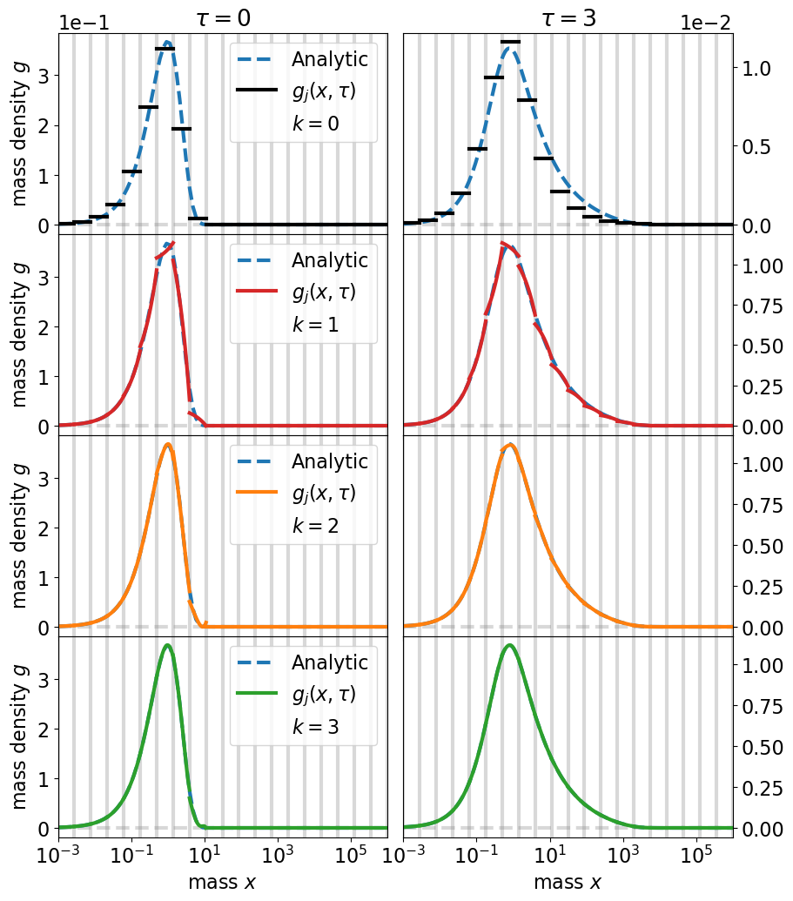
</p>

The corresponding scripts are ``` plot_kadd_xmean_xmeanlog.py ``` and ``` plot_kadd_error_moments.py ```.
<div class="row">
   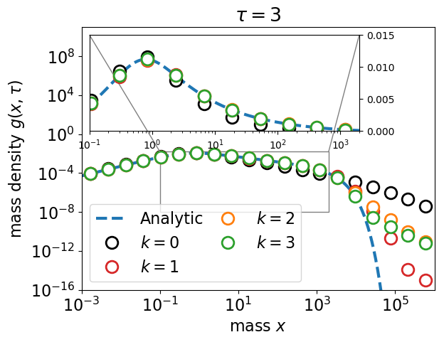
   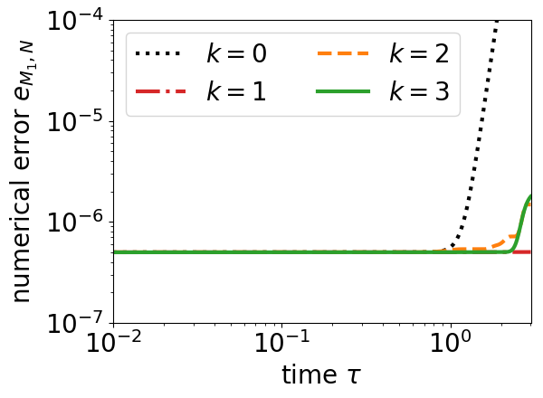
</div>

###### Stability in time
Data are located in ``` kadd/data/simu```.
The corresponding script is ``` plot_kadd_errors_simu.py ```.

<p align="middle">
   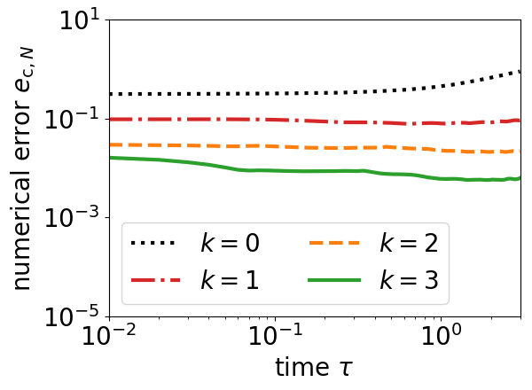
   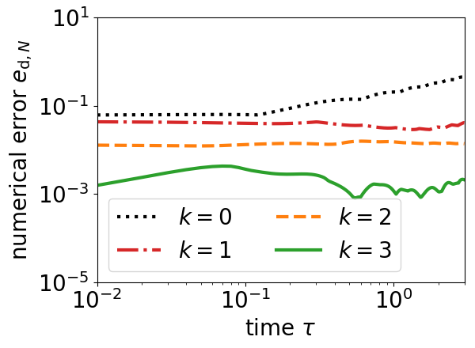
</p>

###### Convergence analysis
Data are located in ``` kadd/data/EOC```.
The corresponding script is ``` plot_kadd_convergence.py ```.

<p align="middle">
   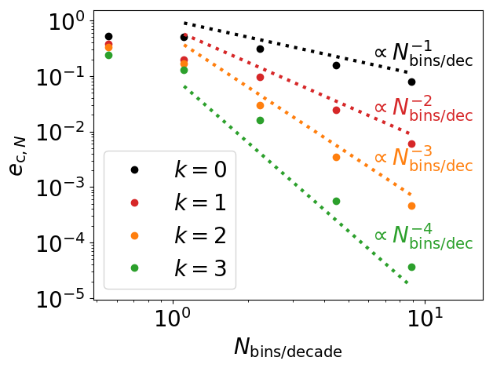
   
</p>


###### Computational efficiency
Data are located in ``` kadd/data/perf``` with the files ```perf.txt```. The time for DG is "time ODE perf" and for DGGQ is "time perf". 
The corresponding script is ```plot_kadd_DG_DGGQ_perf.py```.

Improvement by a factor ~ 2000 in computational time. 

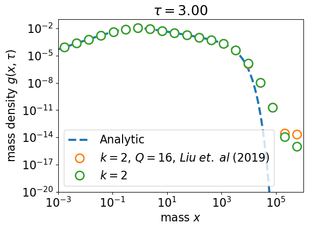


#### Multiplicative kernel

##### Positivity, mass conservation and accuracy

Data are located in ``` kmul/data/simu```.

The corresponding script is ``` plot_kmul_simu.py ```.


<p align="middle">
   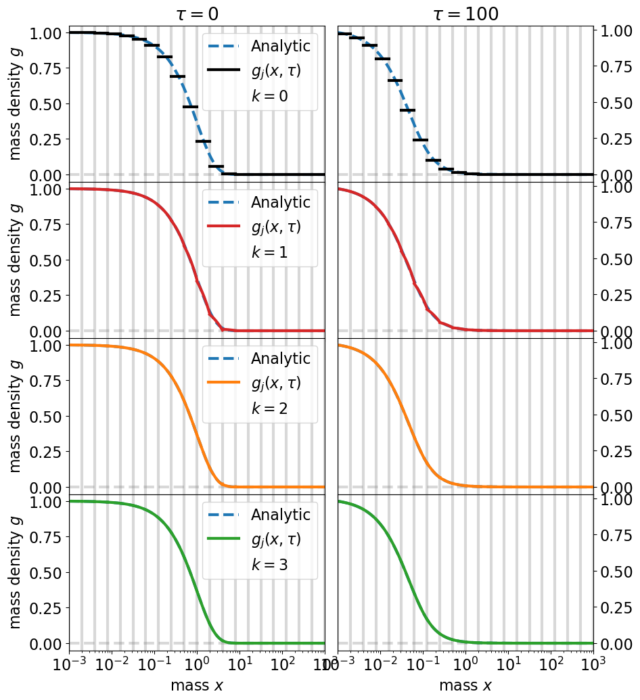
</p>


The corresponding script is ``` plot_kmul_xmean_xmeanlog.py ```.
<p align="middle">
   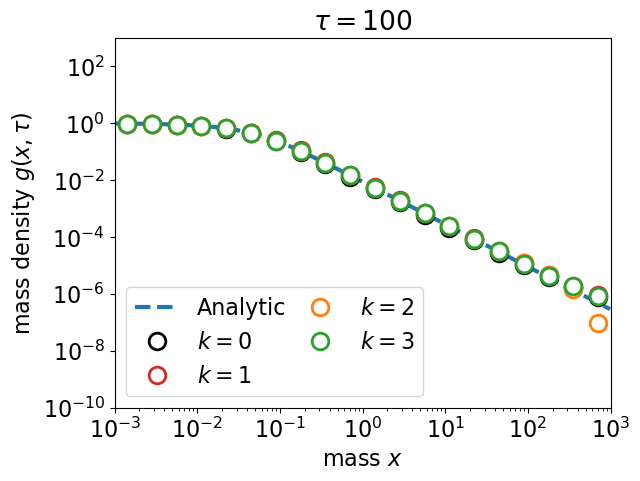
</p>

The corresponding script is  ``` plot_kmul_error_moments.py ```.
<div class="row">
   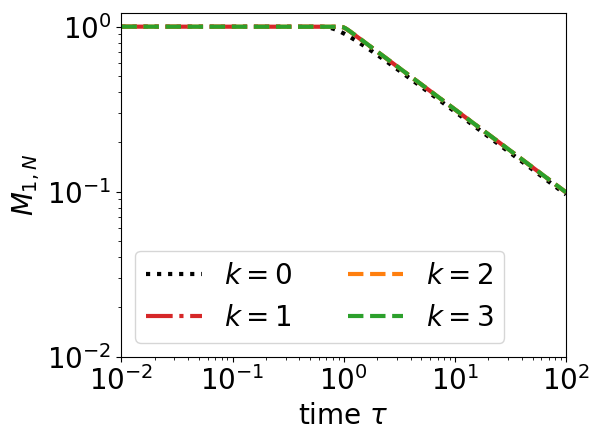
   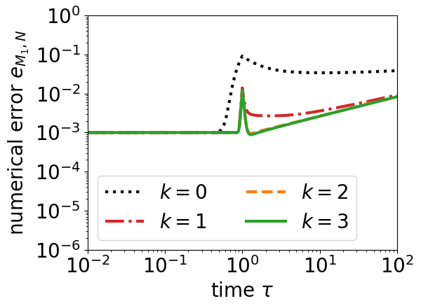
</div>

###### Stability in time
Data are located in ``` kmul/data/simu```.
The corresponding script is ``` plot_kmul_errors_simu.py ```.

<p align="middle">
   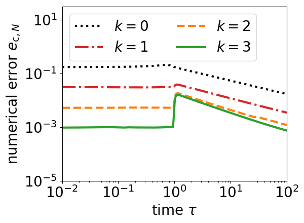
   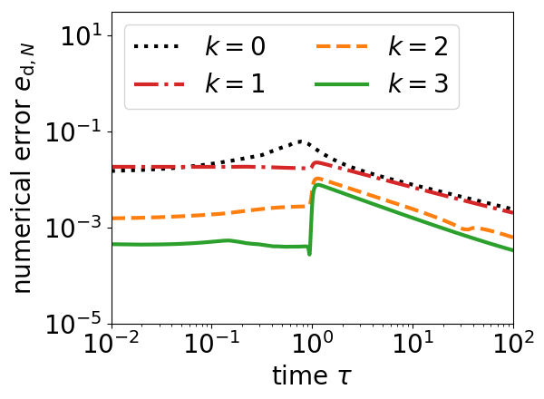
</p>

###### Convergence analysis
Data are located in ``` kmul/data/EOC```.
The corresponding script is ``` plot_kmul_convergence.py ```.

<p align="middle">
   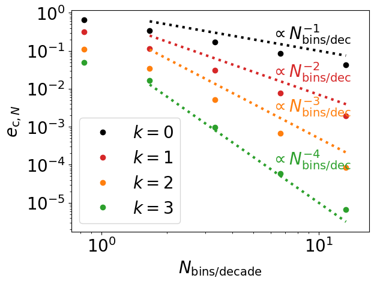
   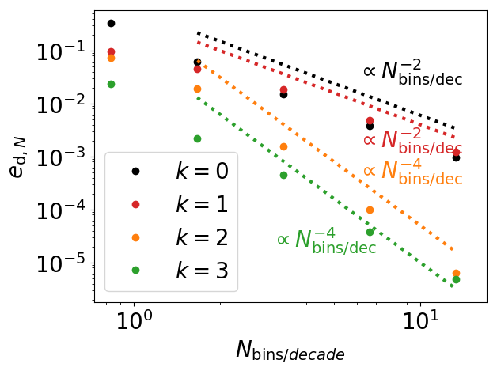
</p>


###### Computational efficiency
Data are located in ``` kmul/data/perf``` with the files ```perf.txt```. The time for DG is "time ODE perf" and for DGGQ is "time perf". 
The corresponding script is ```plot_kmul_DG_DGGQ_perf.py```.

Improvement by a factor ~ 8 in computational time. 

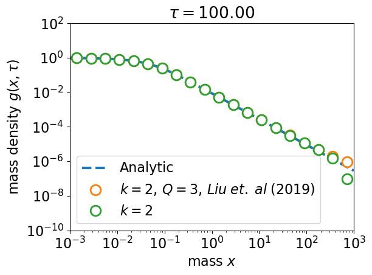


   
