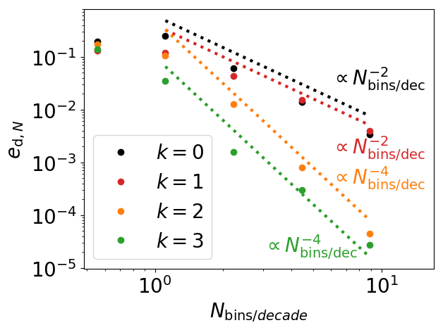

# Grain growth for astrophysics with Discontinuous Galerkin schemes
by Maxime Lombart and Guillaume Laibe

Manuscript is submitted for publication in the Monthly Notices of the Royal Astronomical Society.

This repository contains the data and code used to reproduce all figures shown in the paper.

## Abstract
Depending on their sizes, dust grains store more or less charges, catalyse more or less chemi- cal reactions, intercept more or less photons and stick more or less efficiently to form embryos of planets. Hence the need for an accurate treatment of dust coagulation and fragmentation in numerical modelling. However, existing algorithms for solving the coagulation equation are over-diffusive in the conditions of 3D simulations. We address this challenge by developping a high-order solver based on the Discontinuous Galerkin method. This algorithm conserves mass to machine precision and allows to compute accurately the growth of dust grains over several orders of magnitude in size with a very limited number of dust bins.

## Results
Python 3 is used to produce figures for constant, additive and multiplicative coagulation kernels.

### Benchmarks
#### Constant kernel

##### Positivity, mass conservation and accuracy

   

   
   

###### Stability in time

   
   

###### Convergence analysis

   
   

###### Computational efficiency
Improvement by a factor ~ 4 in computational time. 

#### Additive kernel

##### Positivity, mass conservation and accuracy

   

   
   

###### Stability in time

   
   

###### Convergence analysis

   
   

###### Computational efficiency
Improvement by a factor ~ 2000 in computational time. 

#### Multiplicative kernel

##### Positivity, mass conservation and accuracy

   

   
   

###### Stability in time

   
   

###### Convergence analysis

   
   

###### Computational efficiency
Improvement by a factor ~ 2000 in computational time. 

   
